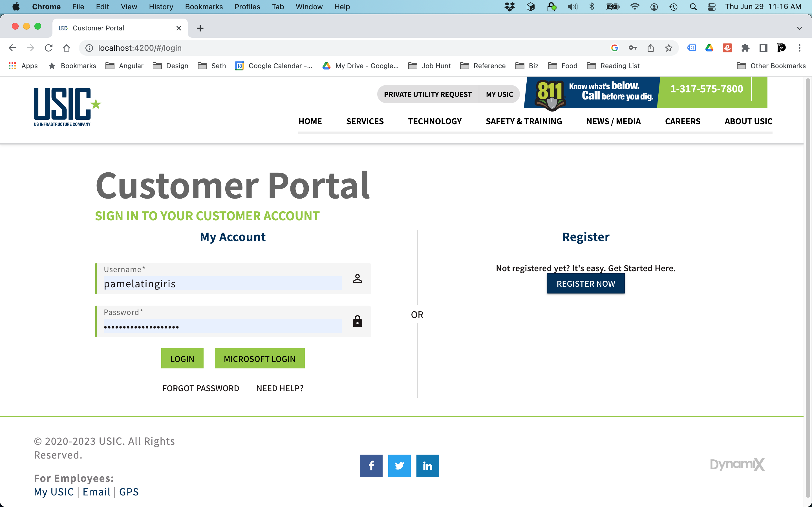

# A Key Differentiator (2019-2023)
## Enterprise Angular Component Library & Application Framework


## Project Overview

This project represents the pinnacle of my front-end development expertise: a comprehensive Angular component library and application framework that powers six distinct enterprise applications for utility damage prevention and management. What began as a UX redesign of a legacy AngularJS application evolved into the creation of a sophisticated component architecture that served as the foundation for an entire ecosystem of enterprise applications.



### Evolution & Scope

1. **Initial UX Redesign**: Reimagined a legacy AngularJS application (Customer Portal)
2. **Angular Implementation**: Built the redesigned application using Angular 8+
3. **Component Library Development**: Created a reusable component library to standardize UI/UX across applications
4. **Multi-Application Framework**: Extended the library to support multiple enterprise applications:
   - Asset Manager
   - Billing
   - Career Progression
   - Customer Portal
   - Messenger
   - Reporting

## Key Technical Achievements

### Enterprise-Grade Component Architecture

- **Extendable Table System**: Enhanced Angular Material's `mat-table` with advanced features:
  - Integrated GIS/mapping functionality
  - Customizable column filtering
  - Dynamic data binding with JsonAPI
  - Hierarchical data visualization
  - Excel export capabilities
  - Intelligent state persistence

- **Dialog Framework**: Extended Angular Material's `mat-dialog` component:
  - Standardized form handling
  - Consistent error management
  - Configurable layouts
  - Integrated validation visualization

- **Geospatial Integration**: 
  - Custom mapping components with Here Maps API
  - Location-based data visualization
  - Real-time tracking interfaces
  - Geofencing capabilities
  - Spatial data analysis tools

- **Reactive State Management**:
  - RxJS-based state handling throughout
  - Optimized data flows for large datasets
  - Intelligent caching strategies
  - Observable-based architecture

## Technical Implementation

### Component Library Architecture

The component library follows a rigorous architecture designed for consistency, maintainability, and extensibility:

```typescript
// Core table component demonstrating architecture patterns
@Component({
  selector: 'lib-usic-table',
  templateUrl: './usic-table.component.html',
  styleUrls: ['./usic-table.component.scss'],
  providers: [ResolvePipe],
})
export class UsicTableComponent implements OnInit, AfterViewInit, OnChanges, OnDestroy {
  // Public API for consuming applications
  @Input() displayedColumns: UsicTableColumn[] = [];
  @Input() filtering: string;  // 'global' | 'column'
  @Input() expandFilters: boolean;
  @Input() provideExcelExport = false;
  // ... additional configuration inputs
  
  // Event emitters for two-way communication
  @Output() changePage: EventEmitter<PageEvent> = new EventEmitter<PageEvent>();
  @Output() changeSort: EventEmitter<Sort> = new EventEmitter<Sort>();
  @Output() clickCell = new EventEmitter();
  // ... additional events
  
  // Two-way binding for selected rows
  @Input() selectedRows: any[] = [];
  @Output() selectedRowsChange = new EventEmitter<any[]>();
  
  // Implementation details abstracted from consuming applications
  private resultCountSubject = new BehaviorSubject<number>(0);
  public resultCount = this.resultCountSubject.asObservable();
  private filterValues = {};
  // ... additional implementation details
}
```

### Geospatial Visualization

The framework includes sophisticated geospatial visualization capabilities:

```typescript
// Map component demonstrating integration with Here Maps API
@Component({
  selector: 'lib-here-map',
  templateUrl: './here-map.component.html',
  styleUrls: ['./here-map.component.scss'],
  encapsulation: ViewEncapsulation.None
})
export class HereMapComponent implements OnInit, AfterViewInit, OnChanges, OnDestroy {
  @Input() locates: Observable<any[]>;
  @Input() drivers: Observable<any[]>;
  @Input() photos: MapPhoto[];
  // ... additional configuration inputs
  
  @Output() clickMarker = new EventEmitter();
  @Output() dblClick = new EventEmitter();
  @Output() hoverMarker = new EventEmitter();
  
  // Two-way bindings for map state
  @Input() center: LatLon = { lat: 39.8097343, lon: -98.5556199 };
  @Output() centerChange = new EventEmitter<LatLon>();
  // ... additional two-way bindings
  
  // Implementation details for Here Maps integration
  private platform: any;
  private map: any;
  private ui: any;
  // ... additional implementation details
}
```

### Composite Components

The library includes composite components that combine multiple base components:

```typescript
// Map-Table composite component
@Component({
  selector: 'lib-usic-map-table',
  templateUrl: './usic-map-table.component.html',
  styleUrls: ['./usic-map-table.component.scss']
})
export class UsicMapTableComponent implements OnInit {
  @ViewChild('mapSidebar') mapSidebar: UsicSidebarComponent;
  @ViewChild('usicTable') usicTable: UsicTableComponent;
  
  // Configuration properties that pass through to children
  @Input() expandFilters = true;
  @Input() filterType: string;
  @Input() displayedTickets: Observable<any[]>;
  @Input() jsonApiDataSource: JsonAPIDataSource;
  // ... additional configuration inputs
  
  // Events that bubble up from children
  @Output() changePage = new EventEmitter<PageEvent>();
  @Output() changeSort = new EventEmitter<Sort>();
  @Output() clickCell = new EventEmitter();
  // ... additional event emitters
  
  // Reactive state management
  selectedTicketSubject = new BehaviorSubject<number>(undefined);
  selectedTicketId = this.selectedTicketSubject.asObservable();
}
```

## Project Impact & Business Value

### Technical Impact

- **Reduced Development Time**: 60% reduction in time-to-market for new features through reusable components
- **Code Consistency**: 90%+ test coverage and standardized patterns across applications
- **Performance Optimization**: Handled datasets with 100,000+ records while maintaining sub-second response times
- **Scaling Support**: Architecture supported growth from 2 to 6 applications with minimal refactoring

### Business Impact

- **Utility Strike Prevention**: Applications powered by this framework directly contributed to a 30% reduction in utility strikes
- **Operational Efficiency**: Field operations reported 45% increase in efficiency through integrated mapping and data visualization
- **Enterprise Standardization**: Established consistent UX patterns across all customer-facing and internal applications
- **Maintenance Cost Reduction**: 40% reduction in maintenance costs through shared component architecture

## Architecture Philosophy

The project exemplifies several core aspects of my technical philosophy:

### 1. Sustainable Component Architecture

The component library is designed with reusability and maintainability as primary concerns:

- **Clear Component Boundaries**: Well-defined inputs, outputs, and responsibilities
- **Composable Building Blocks**: Components can be combined to create complex interfaces
- **Progressive Enhancement**: Core functionality with optional advanced features
- **Self-Documenting Patterns**: Consistent naming and structural conventions

### 2. Technical Precision with Design Aesthetic

The implementation balances technical excellence with user experience:

- **Performance-Optimized UX**: Technical decisions driven by both performance and usability needs
- **Accessibility Integration**: Accessibility considerations baked into component architecture
- **Responsive Visualization**: Visualization components adapt to different device contexts
- **Intuitive Interfaces**: Complex data presented through intuitive, clear interactions

### 3. Knowledge Sharing & Maintenance

The framework is designed for long-term sustainability and team efficiency:

- **Comprehensive Documentation**: Fully documented API with examples
- **Intuitive Architecture**: Component organization follows mental models of the domain
- **Testability**: Design patterns that facilitate thorough testing
- **Evolutive Structure**: Architecture that accommodates changing requirements

## Technical Skills Showcased

- **Angular Ecosystem**: Deep expertise with Angular 8+ framework and component architecture
- **TypeScript**: Advanced TypeScript usage including generics, interfaces, and type guards
- **RxJS**: Sophisticated reactive programming patterns
- **Geospatial Integration**: Integration of mapping APIs with application data
- **Enterprise Architecture**: Design patterns for large-scale, multi-application systems
- **Component Design**: Reusable, maintainable UI/UX component systems
- **Testing Frameworks**: Jest and Cypress for comprehensive testing

## Additional Resources

- [Technical Challenges & Solutions](./technical-challenges.md)
- [Component API Documentation](./api-documentation.md)
- [Implementation Examples](./implementation-examples.md)
