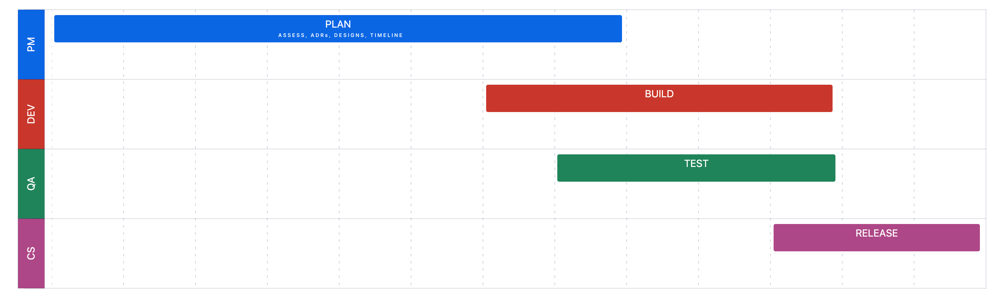

# AI-Powered Letters of Medical Necessity (2024)
## Leading AI Integration for Healthcare Documentation


## Project Overview
In 2024, I led a cross-functional team in implementing an innovative AI solution that transformed how orthotics and prosthetic practitioners create Letters of Medical Necessity. This project integrated custom LLM technology with a legacy healthcare application, enabling practitioners to convert voice recordings into professionally formatted, compliant documentation—significantly reducing their administrative burden and improving patient care efficiency.

## Key Achievements
- **Timeline Recovery**: Took over a project 6 months behind schedule and delivered a month ahead of the revised timeline
- **Team Leadership**: Successfully led a diverse team of seven specialists across multiple disciplines
- **HIPAA Compliance Crisis**: Overcame mid-project compliance issues by reallocating resources for in-house development
- **Quality Metrics**: Achieved over 90% test coverage, substantially reducing post-release issues
- **Business Impact**: Exceeded pre-set revenue goals within the first quarter after release

## Leadership Role & Team Composition
As Project Manager, I was responsible for:
- Strategic planning and execution oversight
- Cross-functional team leadership
- Technical scoping and architecture guidance
- Stakeholder communications and expectation management
- Quality assurance and compliance verification
- Timeline and resource management

I led a diverse team of seven specialists:
- Product Manager (feature requirements)
- Product Designer
- QA/Test Engineer
- Platform Engineer (LLM refinement & platform integration)
- Backend Architect/Engineer
- Full Stack Engineer
- Frontend Engineer

## Technical Challenges Overcome

### HIPAA Compliance Crisis
Mid-project, we discovered that the contracted custom LLM lacked required HIPAA compliance—a critical business requirement. This threatened both the project timeline and viability of the feature itself.

### Legacy System Integration Hurdles
The technical workflow of recording and uploading voice memos, processing them through the AI, and converting results to specifically formatted PDFs involved navigating multiple technical incompatibilities between cutting-edge AI technology and a legacy product with deprecated components.

### Authentication Architecture Limitations
The existing product architecture had no provisions for guest users, which our feature required. This necessitated expanding the project scope to include fundamental authentication modifications.

## Architecture & Technical Strategy

The integration required bridging multiple systems and technologies:

```
┌─────────────────────┐     ┌───────────────────────┐     ┌─────────────────────┐
│ AngularJS Recording │────▶│   Legacy Backend      │────▶│  Custom LLM         │
│ Interface           │     │   API Gateway         │     │  Processing Engine  │
└─────────────────────┘     └───────────────────────┘     └─────────────────────┘
             ▲                        │                          │
             │                        ▼                          ▼
      ┌─────────────────┐     ┌─────────────────┐     ┌─────────────────┐
      │ Modern Angular  │◀────│ PDF Generation  │◀────│ Processing      │
      │ UI (Rendering)  │     │ Legacy System   │     │ Response        │
      └─────────────────┘     └─────────────────┘     └─────────────────┘
```

## Implementation Approach & Leadership Strategy

Facing a previously failed implementation and significant technical debt, I implemented a structured yet adaptive approach:

1. **[Architect, Design, Build, Test, Release Framework](./images/project-management-timeline.png)**
   I established a clear progression pathway that kept the team aligned while allowing for necessary iterations and adjustments.

2. **Collaborative Architecture Process**
   Rather than imposing technical decisions, I implemented a collaborative planning process that guided less experienced engineers in creating architectural diagrams. These diagrams then served as blueprints for development, fostering both ownership and clarity.

3. **Daily Solutioning Sessions**
   I facilitated focused problem-solving meetings where team members could collaborate on technical challenges, fostering innovation and rapid obstacle resolution.

4. **Situational Leadership Model**
   I created an environment where leadership could shift based on the challenge at hand, allowing those with relevant technical skill, functional knowledge, or domain expertise to guide decisions. This approach empowered team members and led to more effective solutions.



## Technical Details
- [Leadership Case Study](./leadership-case-study.md)
- [Technical Implementation Details](./technical-implementation.md)

## User Experience Considerations

Working closely with the Product Manager and Designer, we addressed several healthcare-specific UX requirements:

1. **Clinical Workflow Integration**
   The feature was designed to slot seamlessly into practitioners' existing workflows, minimizing learning curves and adoption friction.

2. **Verification Interface**
   Given the critical nature of medical documentation, we implemented an intuitive review and edit interface allowing practitioners to verify AI-generated content before finalization.

3. **Privacy-First Recording**
   The voice recording interface was designed with visual indicators of active recording and explicit consent mechanisms to ensure patient awareness.

## Legacy and Future Direction

This project established a foundation for continuing AI integration in the healthcare product:

1. **Expandable AI Framework**
   The architecture we created supports additional AI-powered features beyond the initial Letters of Medical Necessity.

2. **Mobile Expansion Readiness**
   The initial design accounted for future mobile recording capabilities, planned for subsequent releases.

3. **Knowledge Transfer Documentation**
   Comprehensive documentation was created to support ongoing development and maintenance by future teams.

4. **Pattern Library Contributions**
   The project generated reusable patterns for AI integration that have been incorporated into the organization's development standards.
