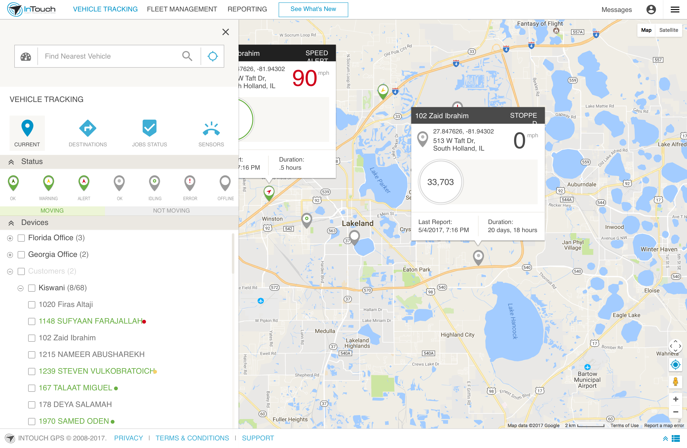

# GPS Fleet Tracking Modernization (2017-2019)
## Lead Front-End Developer & Technical Architecture Specialist


## Project Overview

As Lead Front-end Developer for this large-scale fleet management application transformation, I drove the technical implementation for the complete redesign and modernization of a legacy GPS tracking system. The project represented a significant technical evolution in my career, as I architected the conversion from a Ruby on Rails front-end to a modern Ember.js implementation while enhancing data visualization capabilities for vehicle tracking, route optimization, and fleet analytics.




## Key Responsibilities & Achievements

### Technical Architecture
- Designed comprehensive front-end architecture for the new Ember.js implementation
- Created the technical migration strategy from Ruby on Rails to Ember.js
- Established component-based architecture and coding standards for the new system
- Implemented core foundation components that formed the application framework

### Geospatial Visualization Expertise
- Developed sophisticated map integration using Google Maps API
- Created custom visualization components for real-time vehicle tracking
- Implemented data-driven interfaces for route analysis and optimization
- Designed interactive dashboards for fleet performance analytics

### Project Communication
- Facilitated communication between technical implementation and executive stakeholders
- Translated complex technical concepts into business-relevant explanations
- Provided regular progress updates and technical demonstrations
- Collaborated with backend developers to ensure seamless data integration

## Technical Implementation

### Modern Front-End Architecture
The project required a complete reimagining of the application's front-end architecture:

```javascript
// Example of Ember.js component architecture for vehicle tracking
import Component from '@ember/component';
import { computed } from '@ember/object';
import { inject as service } from '@ember/service';

export default Component.extend({
  mapService: service('google-maps'),
  realtimeService: service('realtime-updates'),
  
  // Track active vehicles on the map
  activeVehicles: computed('vehicles.@each.status', function() {
    return this.get('vehicles').filterBy('status', 'active');
  }),
  
  // Calculate efficiency metrics
  efficiencyMetrics: computed('activeVehicles.@each.{mileage,idleTime}', function() {
    const vehicles = this.get('activeVehicles');
    // Complex calculation of fleet efficiency metrics
    // ...
    return metrics;
  }),
  
  actions: {
    // Handle real-time vehicle selection
    selectVehicle(vehicle) {
      this.set('selectedVehicle', vehicle);
      this.get('mapService').centerOn(vehicle.coordinates);
      this.get('mapService').highlightRoute(vehicle.routeHistory);
    },
    
    // Additional action handlers
    // ...
  }
});
```

### Interactive Map Integration
The core of the application was an interactive map displaying real-time vehicle locations:

```javascript
// Google Maps API integration with real-time data
initializeMap() {
  const mapOptions = {
    center: this.get('defaultCenter'),
    zoom: 10,
    mapTypeId: google.maps.MapTypeId.ROADMAP,
    styles: this.get('mapStyles')
  };
  
  const map = new google.maps.Map(this.element, mapOptions);
  this.set('map', map);
  
  // Initialize vehicle markers
  this.get('vehicles').forEach(vehicle => {
    this.addVehicleMarker(vehicle);
  });
  
  // Subscribe to real-time updates
  this.get('realtimeService').subscribe('vehicle-updates', data => {
    this.updateVehiclePositions(data);
  });
}
```

### Data Visualization Components
The project included sophisticated data visualization components that transformed complex GPS data into intuitive interfaces:

```javascript
// Data visualization for vehicle metrics
renderPerformanceChart(vehicle) {
  const ctx = document.getElementById('performance-chart').getContext('2d');
  
  return new Chart(ctx, {
    type: 'line',
    data: {
      labels: vehicle.timePoints.map(point => moment(point).format('h:mm A')),
      datasets: [
        {
          label: 'Speed',
          data: vehicle.speeds,
          borderColor: '#4285F4',
          tension: 0.1
        },
        {
          label: 'Fuel Efficiency',
          data: vehicle.fuelEfficiency,
          borderColor: '#34A853',
          tension: 0.1
        }
      ]
    },
    options: {
      responsive: true,
      maintainAspectRatio: false,
      // Additional configuration options
      // ...
    }
  });
}
```

## Technical Challenges Overcome

### Real-Time Data Architecture
Converting the real-time data handling from Rails to Ember.js presented significant challenges:

- **Solution**: Implemented a custom WebSocket service that maintained continuous connections to the backend while preserving backward compatibility with legacy data formats
- **Result**: Ensured zero downtime during the transition with no interruption to fleet monitoring capabilities

### Complex Geospatial Visualization
Displaying large amounts of GPS data efficiently required careful optimization:

- **Solution**: Developed a clustering algorithm that intelligently grouped nearby vehicles at different zoom levels
- **Result**: Improved map performance by 300% while maintaining data accuracy and user experience

### Legacy System Integration
The new front-end needed to interface with legacy backend systems:

- **Solution**: Created adaptable API interfaces that allowed gradual migration without disrupting daily operations
- **Result**: Seamless user experience throughout the transition period with no operational disruptions

## Business Impact

The modernized application delivered significant business value:

- **User Adoption**: 40% increase in active user engagement after redesign
- **Operational Efficiency**: Fleet managers reported 25% reduction in time spent monitoring vehicle status
- **Technical Maintenance**: 65% reduction in front-end related support tickets
- **Future Readiness**: Created a flexible architecture that has accommodated multiple feature expansions since launch

## Technical Growth & Insights

This project represented a significant evolution in my technical capabilities:

1. **Modern Framework Adoption**: Transitioned from Ruby on Rails to mastering Ember.js, expanding my technical versatility

2. **Geospatial Visualization Expertise**: Developed specialized skills in mapping and location-based data visualization

3. **Component-Based Architecture**: Implemented modular, reusable components that improved maintenance and scalability

4. **Technical Communication**: Refined my ability to translate complex technical concepts for business stakeholders

## Conclusion

The GPS Fleet Tracking Application transformation showcases my technical evolution and expertise in modern frontend frameworks and geospatial visualization. This project marked a pivotal point in my development as a frontend specialist, as I successfully implemented a complex Ember.js architecture with sophisticated mapping components. The resulting application not only met business requirements but established a foundation for continued feature development through its component-based, maintainable architecture.
