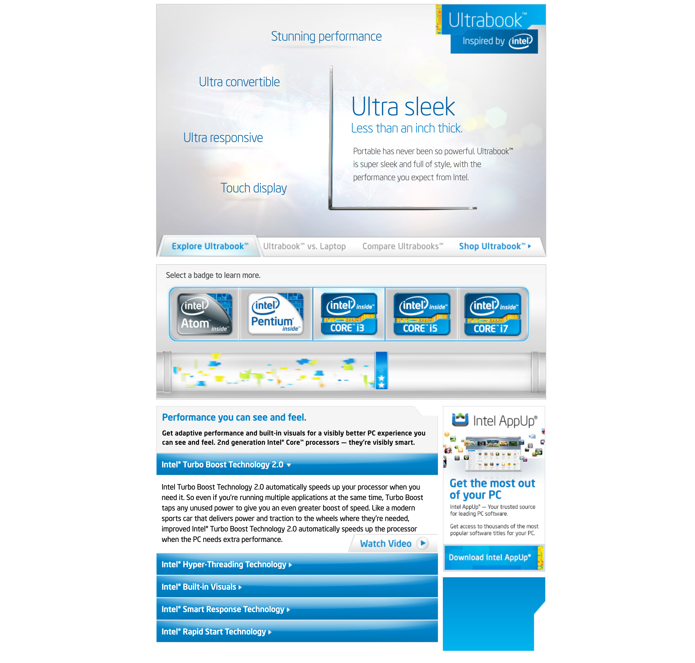

# Intel Ultrabook Campaign (2013)
## Hand-Crafted Digital Experience for Walmart.com


## Project Overview
In 2013, I developed a custom interactive landing page for Intel's Ultrabook campaign that appeared on Walmart.com. This high-visibility project represented cutting-edge front-end development techniques of that era, showcasing Intel's premium laptop technology through an equally innovative digital experience.

## Key Achievements
- Hand-coded a high-performance HTML5, CSS3, and JavaScript solution
- Implemented progressive HTML5 structure when HTML5 was still gaining browser support
- Created smooth CSS3 animations and transitions when these technologies were emerging
- Developed an interactive processor badge selection system with dynamic content updates
- Hand-crafted a particle animation system for visual engagement
- Ensured cross-browser compatibility when standards support varied significantly

*The original code still works beautifully in modern browsers. This is a significant achievement and highlights the quality of my coding practices from 2013. Clone [intel-ultrabook-2013](https://github.com/ptingiris/intel-ultrabook-2013.git) and open `index.html` in a modern browser to see it in action.*



## Technical Implementation
Working indirectly with Walmart and Intel's marketing team, I hand-coded an HTML5, CSS3, and JavaScript solution that pushed the boundaries of what was possible in browsers at that time:

- **Progressive HTML5 Structure**: Implemented semantic markup when HTML5 was still gaining browser support
- **CSS3 Animations**: Created smooth transitions and visual effects without heavy JavaScript or Flash
- **Interactive Elements**: Developed a processor badge selection system that dynamically updated content
- **Particle Animation System**: Hand-crafted the confetti-like animation seen in the processor selection area
- **Responsive Design Principles**: Ensured adaptability across devices when responsive design was still emerging

## Technical Challenges Overcome

### Cross-Browser Compatibility
In 2013, browser support for CSS3 animations varied significantly. I implemented careful fallbacks and progressive enhancement techniques to ensure consistent experiences.

### Performance Optimization
The animated elements needed to run smoothly even on lower-powered devices. This required careful optimization of animation frames and asset loading.

### Integration Constraints
Working within Walmart.com's platform required adherence to strict technical guidelines while still delivering a premium branded experience.

## Key Code Highlights

### Interactive Badge Selection System
```javascript
// Badge selection with dynamic content updating
$('.processor-badge').on('click', function() {
  var processorType = $(this).data('processor-type');
  
  // Update active state
  $('.processor-badge').removeClass('active');
  $(this).addClass('active');
  
  // Update content area
  $('#processor-details').fadeOut(200, function() {
    $('#processor-details')
      .html(processorContent[processorType])
      .fadeIn(300);
  });
  
  // Trigger particle animation
  triggerParticleEffect(processorType);
});
```

### CSS3 Animation System (With Browser Prefixes)
```css
.particle-container {
  position: relative;
  overflow: hidden;
  height: 120px;
}

.particle {
  position: absolute;
  width: 8px;
  height: 8px;
  background-color: #00a2ff;
  border-radius: 50%;
  
  /* Vendor prefixes required in 2013 */
  -webkit-animation: float 3s infinite;
  -moz-animation: float 3s infinite;
  -ms-animation: float 3s infinite;
  animation: float 3s infinite;
}

/* Multiple keyframe declarations needed in 2013 */
@-webkit-keyframes float {
  0% { -webkit-transform: translateY(120px) rotate(0deg); opacity: 0; }
  50% { opacity: 1; }
  100% { -webkit-transform: translateY(-10px) rotate(360deg); opacity: 0; }
}

@keyframes float {
  0% { transform: translateY(120px) rotate(0deg); opacity: 0; }
  50% { opacity: 1; }
  100% { transform: translateY(-10px) rotate(360deg); opacity: 0; }
}
```

## Technical Details
- [Animation Techniques](./animation-techniques.md)
- [Historical Context](./historical-context.md)

## Code Samples
The `code-samples` directory contains selected code samples demonstrating:
- Feature detection and fallback implementation
- CSS3 animation techniques with vendor prefixes
- Early responsive design implementation

## Impact & Evolution
This project represented an important milestone in my front-end development journey:

- **Client Success**: The campaign successfully showcased Intel's premium products in an engaging format that differentiated them from competitors.

- **Technical Foundation**: The hand-coding techniques I mastered here laid groundwork for my later work with JavaScript frameworks. Understanding how animations and interactions work at a fundamental level continues to inform my architectural decisions in modern frameworks like Angular.

- **Early Adoption**: This work demonstrates my consistent pattern of embracing emerging technologies. Just as I was an early adopter of HTML5 and CSS3 animations then, I've continued to stay at the forefront of front-end innovations throughout my career.

## Visual Design Components
The project featured several key visual elements:

- Ultra-thin laptop hero image with dynamic feature callouts
- Interactive processor badge selection system
- Animated particle effects to enhance user interaction
- Carefully crafted color palette matching Intel's brand guidelines
- Responsive layout adjusting to different viewport sizes
